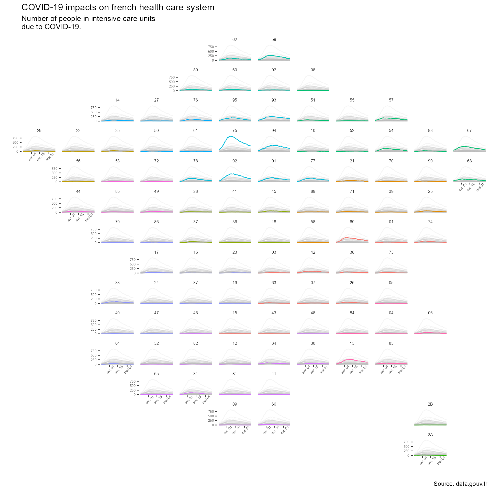

The French government has this website called
[data.gouv.fr](https://data.gouv.fr) with a lot of open access data, including
data on **how the COVID-19 crisis impacts the French healthcare system**. Here,
we can find a
[dataset](https://www.data.gouv.fr/fr/datasets/indicateurs-dactivite-epidemique-covid-19-par-departement/)
with the number of people in intensive care units for every [french
department](https://en.wikipedia.org/wiki/Departments_of_France).

This data set contains a lot of interesting information, including data on how
the COVID-19 crisis affected the [Grand Est
region](https://www.lemonde.fr/planete/article/2020/03/25/coronavirus-le-grand-est-affronte-une-situation-sanitaire-devenue-critique_6034319_3244.html).
Unfortunately, it is the kind of data set which is hard to make sense of at
first glance.

``` r
covid_department_dataset <- 
  readr::read_csv2("https://www.data.gouv.fr/fr/datasets/r/63352e38-d353-4b54-bfd1-f1b3ee1cabd7")

head(covid_department_dataset)
```

    # A tibble: 6 × 10
      dep    sexe jour        hosp   rea HospConv SSR_USLD autres   rad    dc
      <chr> <dbl> <date>     <dbl> <dbl>    <dbl>    <dbl>  <dbl> <dbl> <dbl>
    1 01        0 2020-03-18     2     0       NA       NA     NA     1     0
    2 01        1 2020-03-18     1     0       NA       NA     NA     1     0
    3 01        2 2020-03-18     1     0       NA       NA     NA     0     0
    4 02        0 2020-03-18    41    10       NA       NA     NA    18    11
    5 02        1 2020-03-18    19     4       NA       NA     NA    11     6
    6 02        2 2020-03-18    22     6       NA       NA     NA     7     5

To better vizualize the dataset, we will create a map where we would show the
COVID-19 data for each department. This kind of map has been used before, for
example showing [US unemployment rate between states](https://hafen.github.io/geofacet/).
Here, we will try to create a map of France where every department is a subplot.
These subplots will be **line graphs with the number of person in intensive
care units on the y-axis and the date on the x-axis**.

TO do so, we will use an R package that is dedicated to the creation of
such plots. The `geofacet` R package works with ggplot2 to create
subplots according to a geographical grid. The only information that it needs is
the data set containing those data we want to map (that we already have)
and a data set that is setting up geographical data on a grid.

First, let's start by loading a few packages that could be useful.

``` r
library(tidyverse)     # general wrangling of the data
library(googlesheets4) # to work with google sheets

library(lubridate)     # to work with date

library(geofacet)      # the geofacet package
library(gghighlight)   # add color to the different part of the plot
```

We will then create a data set with the geographical grid we want to use. For
France, we can easily create the grid data set on [googlesheet](https://docs.google.com/spreadsheets/d/1hKY0kjzLm55q1R2jD7FmbRkC6XTb0El4oEbVvi98pwo/)
and then import it into R. The data set is available here, and we can import it
into R in two lines thanks to the `googlesheets4` package (note that you probably
will have to call the `gs4_auth` function at some point).

``` r
departments <- 
  read_sheet("1hKY0kjzLm55q1R2jD7FmbRkC6XTb0El4oEbVvi98pwo", 
             sheet = "departement")
```

Now, because we're greedy and because `googlsheet4` is easy to use, we can
decide to create a second data set so we can add each department's regional
information.

``` r
regions <- 
  read_sheet("1hKY0kjzLm55q1R2jD7FmbRkC6XTb0El4oEbVvi98pwo", 
             sheet = "region")
```

The wrangling we need to do to prepare the data set is minimal. We just have to
remove french departments that we don't want to plot and add for every
department its regional information.

``` r
covid_department_dataset <-
  covid_department_dataset |>
  semi_join(departments,
            by = c("dep" = "code")) |> 
  left_join(regions, 
            by = c("dep" = "code")) |>
  filter(sexe == 0) |> # Because we don't want to make gender-based 
                       # analysis, we keep the overall results 
  filter(jour <= ymd("2020-05-12"))

head(covid_department_dataset)
```

    # A tibble: 6 × 13
      dep    sexe jour        hosp   rea HospConv SSR_USLD autres   rad    dc name  
      <chr> <dbl> <date>     <dbl> <dbl>    <dbl>    <dbl>  <dbl> <dbl> <dbl> <chr> 
    1 01        0 2020-03-18     2     0       NA       NA     NA     1     0 Ain   
    2 02        0 2020-03-18    41    10       NA       NA     NA    18    11 Ainse 
    3 03        0 2020-03-18     4     0       NA       NA     NA     1     0 Allier
    4 04        0 2020-03-18     3     1       NA       NA     NA     2     0 Alpes…
    5 05        0 2020-03-18     8     1       NA       NA     NA     9     0 Haute…
    6 06        0 2020-03-18    25     1       NA       NA     NA    47     2 Alpes…
    # … with 2 more variables: region <chr>, inhabitant <dbl>

Now, we just have to create the plot using the `covid_department_dataset`. Note
that, to make the plot easier to interpret, we can use the `gghighlight`
package that works well with the `ggplot2` faceting system.

``` r
covid_department_dataset |>
  ggplot(aes(y = rea,
             x = jour,
             color = region,
             group = dep)) +
  geom_line() +
  gghighlight(unhighlighted_params = list(alpha = .15)) +
  facet_geo(~ dep,
            grid = departments) +
  labs (x = "",
        y = "",
        title = "COVID-19 impacts on french health care system",
        subtitle = "Number of people in intensive care units\ndue to COVID-19.",
        caption = "Source: data.gouv.fr") +
  theme(text = element_text("Roboto"), 
        plot.caption = element_text("Roboto"),
        strip.background = element_blank(),
        panel.background = element_blank(),
        strip.text = element_text(family = "Roboto", 
                                  size   = 6),
        axis.text = element_text(family = "Roboto", 
                                 size   = 5),
        axis.text.x = element_text(angle = 45),
  )
```


